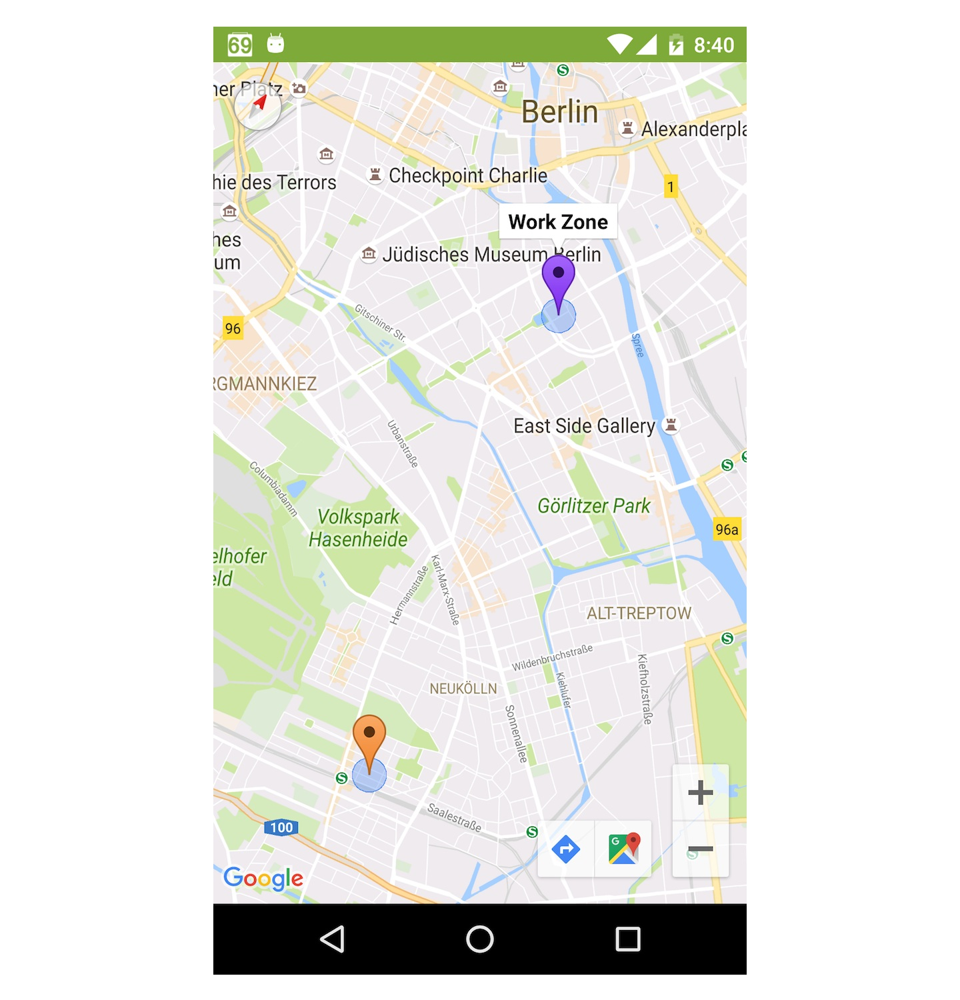

## Overview
The Example project shows how the predict.io SDK works and also how the predict.io SDK should be integrated into your App. This example App list all events received from the predict.io SDK and can be used to test and verify the SDK performance and accuracy.

## User interface

The Sample app has two tabs named "LISTENER EVENTS" and "BROADCAST EVENT".

In the listener tab the event data is received using a listener (you should implement `PredictIOListener` listener).
In the broadcast tab the event data is received via notifications, which are broadcasted by the SDK using `LocalBroadcastManager` API.

Once you've done a test trip you'll see a list of events detected by the SDK. Tapping on list item will show you more details about the event.

#### Home/Work zones
You can see your home/work zones after some trips. To check them; go to the Menu in the upper right corner (3 vertical dots) and tap the "Show home/work zones" option.

## Running and Testing
Before you build and run the Example projects, make sure you set your API key in the app's AndroidManifest.xml file.

On the first launch of the Example App you will see an empty table view, on top-right corner tap the `START` button to activate the SDK. The SDK will verify your API key asynchronously and then will start collecting data.

Our Android SDK relies on sensors data to predict each event. For this reason it can't be tested using a GPS spoofing/mocking mechanism.

#### How to test using an Android device
Start the Example App on your Android phone, put it in your pocket or place at the dashboard. Get to your vehicle and start driving, you should get the departure event on the App in few minutes. Just drive around and then park your vehicle. After predict.io validates your trip i.e. distance travelled and duration, it will send you an arrival event.

Make sure that the SDK is in an active and working state before going on a test trip. To check the status; go to the Menu in the upper right corner (3 vertical dots) and tap the "Status" option.
